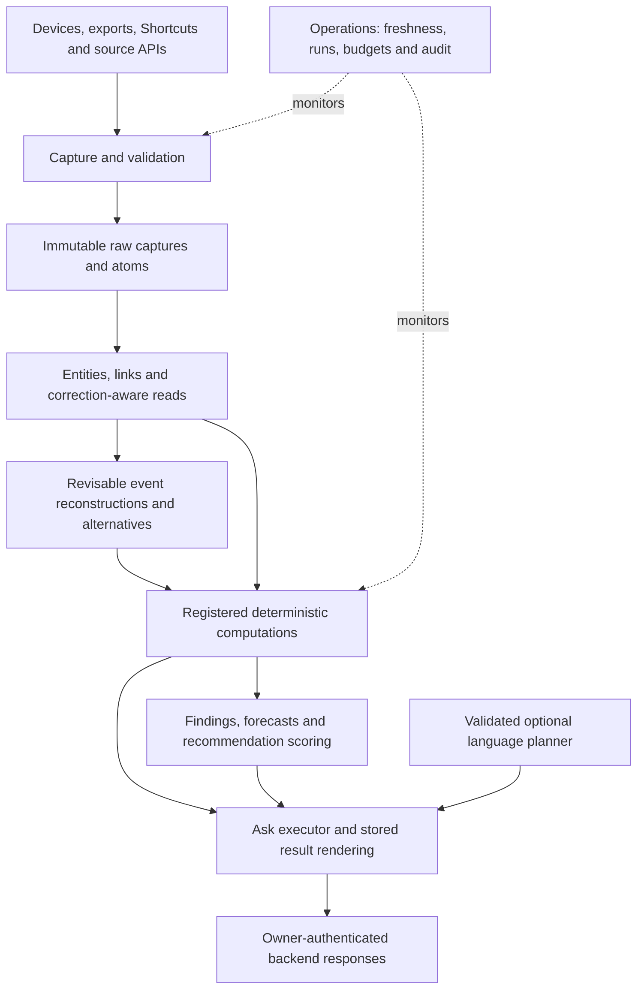

# Backend architecture

Maintained architecture contract, 2026-09-09. Consolidates existing decisions;
introduces no new service or database. Current implementation evidence belongs in
[NEXT_SESSION](NEXT_SESSION.md), not this document. Requirement detail remains in
`specs/`; accepted ADRs govern technical choices.

## Purpose and data flow

The backend turns real observations into reproducible answers. Strength and body
composition are the primary objective, with the other domains providing context.

Arrows show information flow, not permission inheritance. Model planning, private
reads, result persistence and outbound communication require separate capabilities
under ADR-0020. The diagram does not authorize one process to hold all of them.

## Ownership and implementation boundaries

| Component | Responsibility | Existing location / completion owner |
|---|---|---|
| Ingress | Validate source, retain original evidence, deduplicate, reject unsupported records explicitly | `tools/import_drop.py`, `tools/importers/`, capture RPC migrations; B13/B16/B17 |
| Authoritative record | Captures, atoms, superseding corrections, metric definitions, provenance | `core` schema in migrations; existing spine plus domain builds |
| Restricted location | Coordinates and derived visits under separate access and egress rules | `restricted` schema, `supabase/functions/location-ingest/`; B5 and REQ-LOC |
| Entity resolution | Resolve merchants/exercises/places and link related records without guessing identity | Core entities/links; B14/B17/B18 |
| Computation | Own metric formulas, windows, input selection and stored results | `tools/engines/`, analysis schema; B15/B18/B19/B21 |
| Evidence lifecycle | Register, evaluate, confirm/refute, predict, score and demote | resolve/confirm/recommend engines; B7-B10/B19 |
| Ask | Parse or validate a plan, call supported operations, persist results, render with trace | `migrations/0049_ask_core.sql` draft; B11/B20 |
| Shared model services | Approved egress, schema validation, shared usage accounting, deterministic fallback | B12/B16 prerequisites for B11.2; not presumed built |
| Read interface | Owner-authenticated stable responses, units, coverage, tiers and provenance | Public RPC migrations; all domain owners |
| Operations | Actual job execution, data freshness, budgets, failures and deployment evidence | `ops`, `tools/check_freshness.py`, `.github/workflows/`; B13/B22/B23 |

One named owner computes each measure (RULE-12). A second consumer reuses its contract,
not an independently reimplemented formula. Reusing a stored result is valid only
when metric direction, units, lag, window and knowledge cutoff match; otherwise
compute through the owner or disclose/refuse the mismatch.

## Storage and transition

Postgres is authoritative for new captures, atoms, findings and operations.
Legacy Parquet archives remain authoritative for deferred legacy history
(ADR-0016/0028). The old `public` stack and new `core` stack currently coexist;
the mixed panel is a transition, not a second permanent architecture.

Do not bulk-load history or retire old tables merely to simplify the diagram.
Reconcile archive rows, budget storage, demonstrate replacement capture, then
perform B22 with the required per-table authorization. R2/DuckDB are recorded
architectural options, not permission to add an unneeded service now.

## Contracts every path must preserve

1. Input identity: source, timestamp precision, units, presence and trust are explicit.
   Unsupported types and rejected values have counts and reasons; no silent success.
2. Time: occurrence time and recorded time are distinct. Historical answers cannot
   borrow later data, corrections or finding statuses. OQ-53's day-axis decision is
   unresolved; this document does not silently settle it.
3. Corrections: immutable facts are superseded, not overwritten. Apply human overrides
   consistently to current and historical reads under their respective cutoffs.
4. Computation: registered inputs, direction, lag, window, owner and code version are
   stored. Missing condition observations are not negative observations.
5. Evidence: both metrics' coverage matters; estimates retain intervals and methods;
   exploratory results never become confirmed by presentation.
6. Response: every number includes its unit and trace; missing/stale/refusal states
   are supported responses. The frontend formats results and does not calculate them.
7. Model boundary: schema-validated plans, no model-generated SQL, no invented values,
   no model-chosen temporal specification. Shared budget exhaustion degrades to the
   deterministic path. Egress uses only approved destinations with logs.
8. Operations: verify event freshness separately from job success and deployment
   separately from local commits. Never use a recent reimport timestamp as proof of
   recent observations.

## Backend/frontend boundary

Backend release must provide the responses required by Assessment, Record, Movements,
Sources, Findings, Reliability and Desk. Validate response contracts before UI work.
The backend may be implemented and tested for exploratory output, but enabling live
exploration remains subject to RULE-17's proven tier-label surface prerequisite.
No frontend prerequisite is waived by choosing backend-first construction.

## Open decisions

Read the relevant entries in [OPEN_QUESTIONS](OPEN_QUESTIONS.md): OQ-48 screen
semantics, OQ-49 real financial formats, OQ-50 device recovery, OQ-51 metric identity,
OQ-53 day boundaries, and OQ-47 deployment branch. Engineering implementation cannot
substitute for evidence or Joe's reserved measurement decisions.

## Evidence reconstruction: explicit product obligation

[INTENT_COVERAGE](INTENT_COVERAGE.md) traces the original concepts into build owners.
REQ-REC-001..016 and B14R make the gap explicit. Event reconstruction answers what
probably happened; statistical inference evaluates relationships across events. Neither
substitutes for the other. Use existing storage, registered operations and inference
consumers with additive contracts; no separate general-purpose model agent is required.

Reconstructions preserve source/common-origin references, supporting and contradicting
evidence, alternatives, method versions, event time, knowledge time, uncertainty and
human corrections. They do not become raw observations. Consumers propagate uncertainty
and do not reuse an inference's source evidence as independent confirmation of itself.
Historical sources support new retrospective computations without changing what was
known at the earlier date. A current panel alone cannot prove historical replay.

RULE-04 remains binding for retrospective derivations: distinguish the event period
from the computation's knowledge cutoff. The implementation ADR must prove their
representation satisfies recorded-at/window checks before any late-import derived
row is written. Unsupported historical replay remains open; no backdating is allowed.
